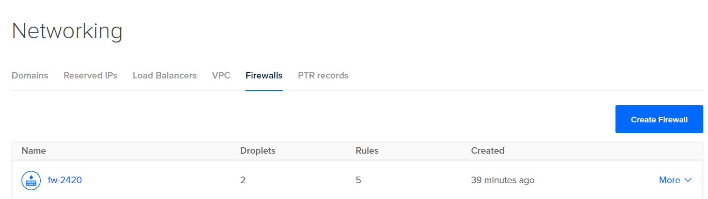

# 2420_assign2

By Brandon Woo

## Tutorial

<br>**Step 1: DO Setup**
- Create 2 Droplets, a VPC, a Load Balancer, and a Firewall.
- The firewall should be configured to allow HTTP traffic on port 5050 to the load balancer




<br>**Step 2: Create 2 users**
- SSH into both droplets and create a user for each of them
- you can use the same name and same password for both


<br>**Step 3: Installing Web Servers**
- install Caddy on both droplets
- make sure to run these 2 commands before installing
```
sudo apt update
sudo apt upgrade
```
- update both droplets


- upgrade both droplets


- to begin the installation caddy, run the command
```
wget https://github.com/caddyserver/caddy/releases/download/v2.6.2/caddy_2.6.2_linux_amd64.tar.gz
```
- this will put a tar file in your home directory

- Unarchive the tar.gz file with
```
tar xvf caddy_2.6.2_linux_amd64.tar.gz
```

- change the owner of the caddy gile and group to root
```
sudo chown root: caddy
```

- copy the caddy file to the bin directory
```
sudo cp caddy /usr/bin/
```


<br>**MAKE SURE TO DO THIS ENTIRE STEP ON BOTH DROPLETS**

<br>**Step 4: Writing the webapp**
- On your local machine, create a new directory
```
mkdir 2420-assign-two
```

- Create two directories called `html` and `src`
```
mkdir html && mkdir src
```

- Inside html directory create an `index.html` page and add some content to it
```
cd html
vim index.html
```
```
<!DOCTYPE html>
<html lang="en">
<head>
    <meta charset="UTF-8">
    <meta http-equiv="X-UA-Compatible" content="IE=edge">
    <meta name="viewport" content="width=device-width, initial-scale=1.0">
    <title>My Cookies</title>
</head>
<body>
    <h1>Cookie Stealer</h1>
    <ul>
        <li>Cookie 1 is mine</li>
        <li>Cookie 2 is mine</li>
        <li>Cookie 3 you can keep</li>
    </ul>
</body>
</html>
```


- Inside of the src directory run the following command
```
npm init
```
- follow the instructions to create the npm files

- now run
```
npm i fastify
```


- create an `index.js` file and put the following content in it
```
// Require the framework and instantiate it
const fastify = require('fastify')({ logger: true })

// Declare a route
fastify.get('/', async (request, reply) => {
  return { hello: 'Server x' }
})

// Run the server!
const start = async () => {
  try {
    await fastify.listen({ port: 3000 })
  } catch (err) {
    fastify.log.error(err)
    process.exit(1)
  }
}
start()
```


- we will have to change some things to this file later
- Install Volta then install node using
```
curl https://get.volta.sh | bash
source ~./.bashrc
volta install node
which npm
```
- It should look like this

- Test the server with
```
node index.js
```
- and follow the link, it should look like this

- move the files to both of your droplets with sftp
```
sftp -i "~/.ssh/DO_key" ocean@165.232.159.95
put 2420-assign-two
```
or

```
rsync -r 2420-assign-two "ocean@165.232.159.95:~/" -e "ssh -i ~/.ssh/DO_key -o StrictHostKeyChecking=no"
```

