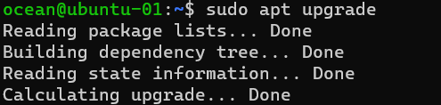
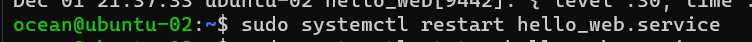

# 2420_assign2

By Brandon Woo

http://24.199.69.253/ <br>
http://24.199.69.253/api

- [2420_assign2](#2420-assign2)
  * [Tutorial](#tutorial)
    + [Step 1: DO Setup](#step-1--do-setup)
    + [Step 2: Create 2 users](#step-2--create-2-users)
    + [Step 3: Installing Web Servers](#step-3--installing-web-servers)
    + [Step 4: Writing the webapp](#step-4--writing-the-webapp)
    + [Step 5: Make the Caddyfile](#step-5--make-the-caddyfile)
    + [Step 6: install volta on droplets](#step-6--install-volta-on-droplets)
    + [Step 7: Write the node service file](#step-7--write-the-node-service-file)
    + [Step 8: Moving the node service file](#step-8--moving-the-node-service-file)
    + [Step 9: Testing](#step-9--testing)

## Tutorial

### Step 1: DO Setup
- Create 2 Droplets, a VPC, a Load Balancer, and a Firewall.
- The firewall should be configured to allow HTTP traffic on port 5050 to the load balancer


### Step 2: Create 2 users
- SSH into both droplets and create a user for each of them
- you can use the same name and same password for both


### Step 3: Installing Web Servers
- install Caddy on both droplets
- make sure to run these 2 commands before installing
```
sudo apt update
sudo apt upgrade
```
- update both droplets


- upgrade both droplets



- to begin the installation caddy, run the command
```
wget https://github.com/caddyserver/caddy/releases/download/v2.6.2/caddy_2.6.2_linux_amd64.tar.gz
```
- this will put a tar file in your home directory

- Unarchive the tar.gz file with
```
tar xvf caddy_2.6.2_linux_amd64.tar.gz
```

- change the owner of the caddy gile and group to root
```
sudo chown root: caddy
```

- copy the caddy file to the bin directory
```
sudo cp caddy /usr/bin/
```


<br>**MAKE SURE TO DO THIS ENTIRE STEP ON BOTH DROPLETS**

### Step 4: Writing the webapp
- On your local machine, create a new directory
```
mkdir 2420-assign-two
```

- Create two directories called `html` and `src`
```
mkdir html && mkdir src
```

- Inside html directory create an `index.html` page and add some content to it
```
cd html
vim index.html
```
```
<!DOCTYPE html>
<html lang="en">
<head>
    <meta charset="UTF-8">
    <meta http-equiv="X-UA-Compatible" content="IE=edge">
    <meta name="viewport" content="width=device-width, initial-scale=1.0">
    <title>My Cookies</title>
</head>
<body>
    <h1>Cookie Stealer</h1>
    <ul>
        <li>Cookie 1 is mine</li>
        <li>Cookie 2 is mine</li>
        <li>Cookie 3 you can keep</li>
    </ul>
</body>
</html>
```

- Inside of the src directory run the following command
```
npm init
```
- follow the instructions to create the npm files

- now run
```
npm i fastify
```


- create an `index.js` file and put the following content in it
```
// Require the framework and instantiate it
const fastify = require('fastify')({ logger: true })

// Declare a route
fastify.get('/', async (request, reply) => {
  return { hello: 'Server x' }
})

// Run the server!
const start = async () => {
  try {
    await fastify.listen({ port: 3000 })
  } catch (err) {
    fastify.log.error(err)
    process.exit(1)
  }
}
start()
```


- Install Volta then install node using
```
curl https://get.volta.sh | bash
source ~/.bashrc
volta install node
which npm
```
- It should look like this

- Test the server with
```
node index.js
```
- and follow the link, it should look like this

- after testing change the index.js file to contain the right route and the right port (`/api`, and `5050`)
```
// Require the framework and instantiate it
const fastify = require('fastify')({ logger: true })

// Declare a route
fastify.get('/api', async (request, reply) => {
  return { hello: 'Server x' }
})

// Run the server!
const start = async () => {
  try {
    await fastify.listen({ port: 5050 })
  } catch (err) {
    fastify.log.error(err)
    process.exit(1)
  }
}
start()
```
- move the files to both of your droplets with sftp
```
sftp -i "~/.ssh/DO_key" ocean@165.232.159.95
put 2420-assign-two
```
or

```
rsync -r 2420-assign-two "ocean@165.232.159.95:~/" -e "ssh -i ~/.ssh/DO_key -o StrictHostKeyChecking=no"
```


### Step 5: Make the Caddyfile
- make a caddyfile with
```
vim Caddyfile
```

-  add the following content
```
http:// {
    root * /var/www/html
    reverse_proxy /api localhost:5050
    file_server
}
```


- upload the caddy file to **BOTH** droplets using sftp

- On each droplet: move the caddy script we installed earlier to /usr/bin

- make a directory in /etc called caddy
```
sudo mkdir /etc/caddy
```

- move the Caddyfile we made to the /etc/caddy directory
```
sudo mv Caddyfile /etc/caddy
```


- create a service file for the caddy server
```
vim caddy.service
```
- and put this inside
```
[Unit]
Description=Serve HTML in /var/www using caddy
After=network.target

[Service]
Type=notify
ExecStart=/usr/bin/caddy run --config /etc/caddy/Caddyfile
ExecReload=/usr/bin/caddy reload --config /etc/caddy/Caddyfile
TimeoutStopSec=5
KillMode=mixed

[Install]
WantedBy=multi-user.target
```

- move the file to the /etc/systemd/system
```
sudo mv caddy.service /etc/systemd/system
```


- restart, start, and enable the service
```
sudo systemctl daemon-reload
sudo systemctl start caddy.service
sudo systemctl enable caddy.service
```


- make a directory called `www` in the `/var` directory with
```
cd /var && mkdir www
```
- move the `src` and the `html` directory we uploaded to the `/var/www` directory
```
sudo mv ./2420-assign-two/src /var/www
sudo mv ./2420-assign-two/html /var/www
```


### Step 6: install volta on droplets

- Install Volta then install node using
```
curl https://get.volta.sh | bash
source ~/.bashrc
volta install node
volta install npm
which npm
```
- It should look like this


### Step 7: Write the node service file
- Create a service file called `hello_web.service` on your local machine and add the following content:
```
[Unit]
Description=node application service file
After=network.target

[Service]
Type=simple
User=ocean
Group=ocean
ExecStart=/home/ocean/.volta/bin/node /var/www/src/index.js
Restart=on-failure
SyslogIdentifier=hello_web

[Install]
WantedBy=multi-user.target
```
### Step 8: Moving the node service file

- put this file on both droplets using sftp and move it to the `/etc/systemd/system`

- reload the daemon again with
```
sudo systemctl daemon-reload
sudo systemctl start hello_web.service
sudo systemctl enable hello_web.service
```
- check that the service is working with
```
sudo systemctl status hello_web.service
```

- do this on both droplets
- Make sure to change one of the html documents so that you can tell if your load balancer is working
```
<!DOCTYPE html>
<html lang="en">
<head>
    <meta charset="UTF-8">
    <meta http-equiv="X-UA-Compatible" content="IE=edge">
    <meta name="viewport" content="width=device-width, initial-scale=1.0">
    <title>My Cookies</title>
</head>
<body>
    <h1>Cookie Stealer</h1>
    <ul>
        <li>Cookie 1 is mine</li>
        <li>Cookie 2 is mine</li>
        <li>Cookie 3 you can keep</li>
    </ul>
    <p>THIS IS SERVER 2</p>
</body>
</html>
```
- Also change the index.js file so that it is slightly different in the `/api` route. For example you can change the `return {hello: 'Server x'}` to `return {hello: 'Server x'}`

- Make sure to do restart the web service after making changes to the html or js
```
sudo systemctl restart hello_web.service
```

### Step 9: Testing
- Test that you can connect to the server, it should look like this
<br>
- if you hit refresh multiple times, it should at some point look different
<br>
- the api route should look like this
<br>
<br>
